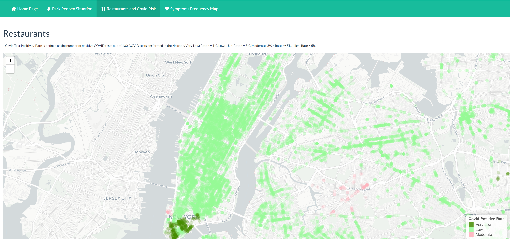

# Project 2: Shiny App Development

### [Project Description](doc/project2_desc.md)



In this second project of GR5243 Applied Data Science, we develop an Outing Avenues in NYC in times of Covid-19* shiny app. This app combines different data sources to provide a ones stop solution for all outing avenues. It also integrates health with all outing avenues to keep the users updated with Covid-19 or other outbreaks in different areas. From dog parks to athletic facilities, from events to restaurants, the app is for all purposes. 
The **objective** of this app are:

- let people explore and enjoy all outing avenues by keeping in mind the recent outbreak
- let people be ahead in decision making by tracking symptoms in different areas

## Project Title: Outing Avenues in NYC in times of Covid-19
Term: Spring 2022

+ Team #4

+ **Project title**: Outing Avenues in NYC in times of Covid-19

+ Team members
	+ Chen, Gexin
	+ Khan, Zaigham
	+ Ma, Xiangyu
	+ Naik, Vaishak
	+ Vedula, Varchasvi

+ **How to use this app**: Visit https://group4goout.shinyapps.io/GoOutapp/ for using this app.   

+ **Project summary**: This app is primarily targeted at the residents of NYC who are looking for outing avenues. Through this app, we aim to suggest the places to visit in NYC by keeping in consideration the Covid outbreak. It also shows the impact of Covid outbreak in outing options and compares the present day options with peak of Covid-19. The app suggests athletic facilities, playgrounds, adult exercise equipment, dog runs, comfort stations and skate parks. The app also displays the events happening in NYC. The app also shows the restaurants in NYC. Along with it, restuarant details and ratings are also shown to the user. Each circle on the map is a restaurant, colored by the COVID risk of the neighborhood it's in. The COVID risk is calculated on the basis of COVID Test Positivity Rate over the past 7 days (updated weekly). Effort has been made to also show clusters of covid near the restaurants and map them to different zones. The app shows a comparison between the peak of Covid-19 and the present day. Finally, to make sure that users are a step ahead of the covid, the app not just tracks covid in different areas, but rather keeps a track of pneumonia like symptoms in different areas. Users can avoid those area as such areas could be a potential outbreak spot. It may continue as the economy recovers and life returns to a semblance of normality.

+ **Contribution statement**: ([default](doc/a_note_on_contributions.md)) All team members contributed equally in all stages of this project. All team members approve our work presented in this GitHub repository including this contributions statement.
 First each of us went through the NYC data and then we collected to brainstorm the best data source to use for this project. Finally, we decided to create an app which could merge the outing options of residents in NYC to the number of covid cases in the area. The roles were definined based on the functionality of the project. Chen, Gexin and Ma, XiangYu collaborated to work on 'Park Reopen Situation' tab. They used the data of athletic facilities, playgrounds, adult exercise equipments, dog runs, comfort stations, skate parks and events to show a comparison of open avenues in NYC during present times as well as the situation at the peak of COVID-19. They also helped in improving the user interface of the app. Vedula, Varchavi worked on the 'Restaurants and Covid Risk' tab. He used the restaurant data set to show the dining options in NYC, but also used the COVID-19 data to highlight the areas with a high covid positivity rate, so that people can take informed decision. Naik, Vaishak worked on the 'Symptoms Frequency Map' and used the emergency hospital registration data to highlight the areas in NYC with a high number of flu-like symptoms. He has also used the symptoms data to show a trend of covid cases in different counties. He was also responsible for smooth working of Git across all the members. Khan, Zaigham worked on the overall look, feel and functionality of the app. He created the map icons to represent different status of outing avenues. He was responsible for creating a final deliverable. Gexin and Zaigham also worked on the deployment of the final app and for ensuring that everything works smoothly.

Following [suggestions](http://nicercode.github.io/blog/2013-04-05-projects/) by [RICH FITZJOHN](http://nicercode.github.io/about/#Team) (@richfitz). This folder is orgarnized as follows.

```
proj/
├── app/
├── lib/
├── data/
├── doc/
└── output/
```

Please see each subfolder for a README file.

